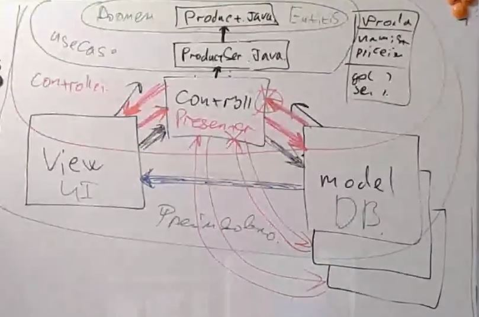
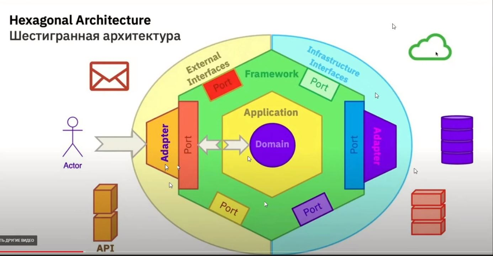
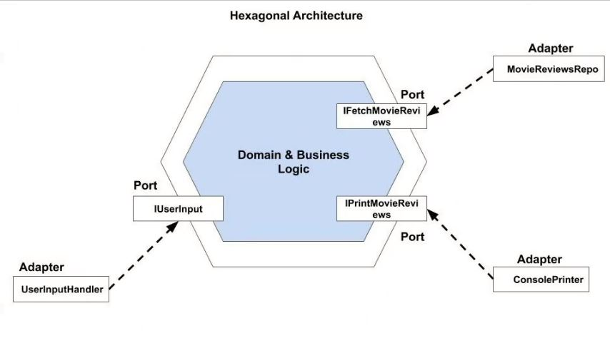
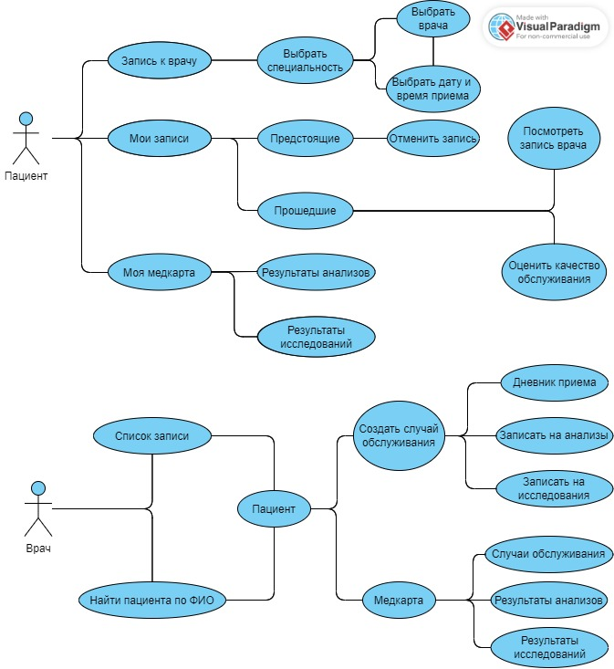

# Урок 6. Принципы построения приложений «чистая архитектура»
## Classwork
### Диаграмма чистой архитектуры:

### MVC и MVP с точки зрения чистой архитектуры:

### Диаграмма шестигранной архитектуры:

### Task001:
Реализация шестигранной архитектуры.

## Homework
Разработать полную ERD домена приложения автоматизации работы поликлиники( в https://www.dbdesigner.net/).

Разработать UseCase диаграмму пациента и доктора в приложении автоматизации работы поликлиники.

(Задание со *) Скопировать себе в репозиторий шестигранную архитектуру и прокомментировать код(разобраться в нем).

Решение сдается в виде jpg файла, залитого на GitHub.